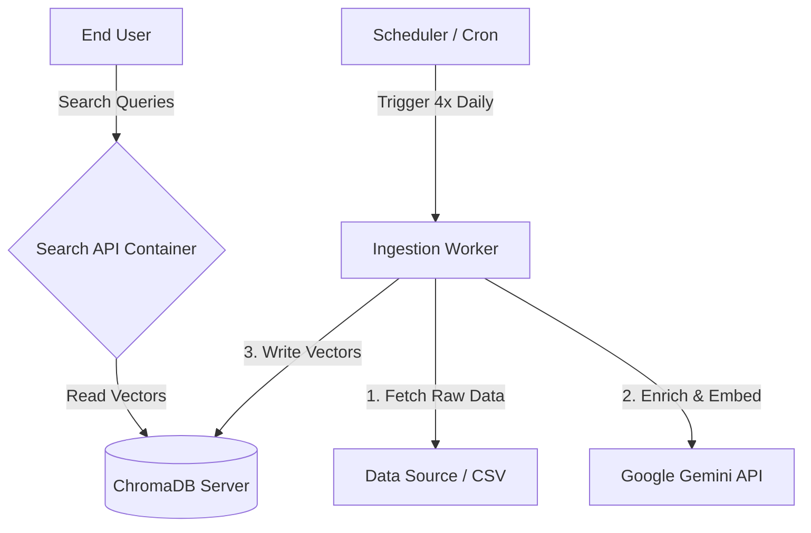

# 🚀 Production Deployment Strategy

To handle **80,000 records/day** (in 4 batches of 20k) while maintaining **Zero Downtime** for search, we recommend moving from a "Local Script" setup to a **Containerized Micro-Services Architecture**.

## 🏗️ Architecture

We will separate the **Database**, **Search API**, and **Ingestion Worker** into three distinct services. This ensures that heavy processing (Embedding/Enrichment) **never slows down** the Search User Interface.



---

## 🛠️ The 3 Services

### 1. Vector Database (ChromaDB Server)
instead of saving to a local file (`./chroma_db`), we run Chroma as a dedicated server.
*   **Why**: Handles concurrent Reads (Search) and Writes (Ingestion) much better than SQLite file mode.
*   **Image**: `chromadb/chroma:latest`
*   **Port**: `8000` (Internal)

### 2. Search API (FastAPI)
State-less application that connects to the Chroma Server.
*   **Replica**: Can scale to 2-3 instances behind a Load Balancer (Nginx) if traffic is high.
*   **Command**: `uvicorn src.api:app --host 0.0.0.0 --port 80`

### 3. Ingestion Worker
A separate process that runs your `ingest_full.py` script.
*   **Schedule**: Runs 4 times a day (Every 6 hours).
*   **Logic**:
    1.  Checks for new data file (e.g., `batch_1.csv`).
    2.  Runs Enrichment (Gemini Flash Lite).
    3.  Pushes Embeddings to Chroma Server.
    4.  Sleeps/Exits.

---

## 🐳 Docker Compose Configuration

Create a `docker-compose.yml` to orchestrate this:

```yaml
version: '3.9'

services:
  # 1. The Brain (Vector DB)
  chroma:
    image: chromadb/chroma:latest
    volumes:
      - ./chroma_data:/chroma/chroma
    ports:
      - "8000:8000"
    environment:
      - IS_PERSISTENT=TRUE

  # 2. The Face (Search API)
  api:
    build: .
    command: uvicorn src.api:app --host 0.0.0.0 --port 8080
    ports:
      - "8080:8080"
    volumes:
      - ./data:/app/data  # <--- CRITICAL: Persist Feedback Logs
    environment:
      - GEMINI_API_KEY=${GEMINI_API_KEY}
      - CHROMA_HOST=chroma
      - CHROMA_PORT=8000
    depends_on:
      - chroma

  # 3. The Hands (Worker)
  ingest_worker:
    build: .
    # Run a script that wakes up, checks for files, processes, and sleeps
    command: python src/scheduler_worker.py
    volumes:
      - ./data:/app/data
    environment:
      - GEMINI_API_KEY=${GEMINI_API_KEY}
      - CHROMA_HOST=chroma
      - CHROMA_PORT=8000
    depends_on:
      - chroma
```

---

## 🔄 Workflow for 80k Records

1.  **Data Arrival**: You place your CSV files (e.g., `lot_1.csv`, `lot_2.csv`) in the mapped `./data` folder.
2.  **Continuous Ingestion**:
    *   The **Ingestion Worker** wakes up (e.g., at 00:00, 06:00, 12:00, 18:00).
    *   It picks up the next CSV.
    *   It runs the pipeline (Enrichment -> Embedding).
    *   It updates ChromaDB over HTTP.
3.  **Continuous Search**:
    *   Users search via the API.
    *   Since ChromaDB is a server, it serves read traffic *while* accepting new writes.
    *   **Zero Downtime**: The API never restarts. New tenders appear in search immediately after indexing.

## ☁️ Deploying to Render (Recommended)

We have included a `render.yaml` Blueprint for 1-click infrastructure setup.

### Architecture on Render
1.  **Private Service (ChromaDB)**: A dedicated Docker container running chroma. Not exposed to the public internet, only to your API.
2.  **Web Service (API)**: Your FastAPI app. Auto-scales and serves traffic.
3.  **Cron Job**: Runs `ingest_full.py` every 6 hours.

### Steps to Deploy
1.  Push your code to GitHub/GitLab.
2.  Go to [dashboard.render.com/blueprints](https://dashboard.render.com/blueprints).
3.  Click **New Blueprint Instance**.
4.  Select your repo.
5.  **Critical**: When prompted, enter your `GEMINI_API_KEY`.
6.  Click **Apply**.

### ⚠️ Data Source for Production
In the local setup, `ingest_full.py` reads a local CSV. On Render (Cron Job), the filesystem is ephemeral (reset every run).
**You must update the ingestion logic** to fetch data from a durable source:

*   **Option A (S3 / Cloud Storage)**:
    Update `src/ingest_full.py` to download the daily CSV from an S3 bucket before processing.
    ```python
    import boto3
    s3.download_file('my-bucket', 'today_tenders.csv', 'input.csv')
    ```

*   **Option B (Direct URL)**:
    If your data provider gives a URL, download it using `requests` at the start of the script.

### Persistence
*   **ChromaDB**: Configured with a `10GB` Persistent Disk. Data survives restarts.
*   **Feedback**: The API has a `1GB` Persistent Disk mounted at `/opt/render/project/src/data`. Your feedback logs are safe.

