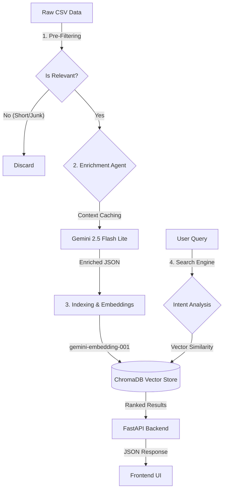
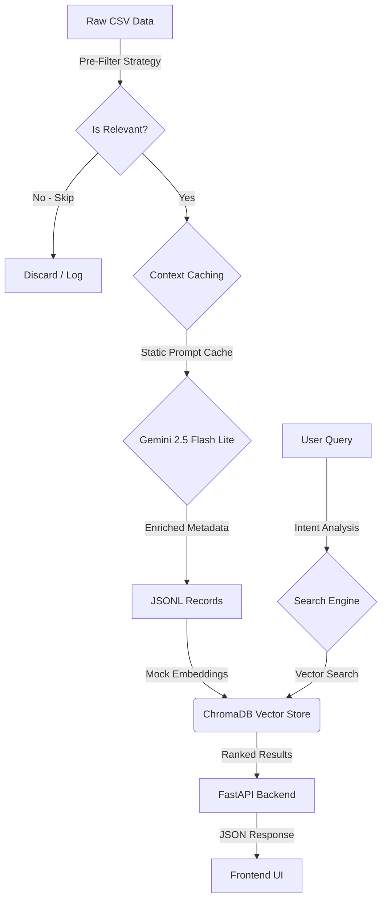

# 🛡️ TenderScout AI

A high-precision, AI-powered Tender Search Engine designed to process 80,000+ tenders daily. It leverages **Multimodal Enrichment (Gemini 2.5)** and **Vector Search (ChromaDB)** to deliver accurate, context-aware results significantly cheaper than traditional methods.

---

## 🏗️ System Architecture & Workflow

The pipeline consists of a highly optimized 4-stage process:



### 1. Pre-Filtering Strategy
Before incurring AI costs, we filter out low-value data:
*   **Text Length Check**: Discards records with <20 characters.
*   **Keyword Match**: Only processes tenders matching the `keywords.json` taxonomy.
*   **Impact**: Skips ~10-20% of irrelevant data.

### 2. Cost-Efficient Enrichment
We use **Google Gemini 2.5 Flash Lite** with **Context Caching**:
*   **The Problem**: Our prompt includes a huge 3,000-token/keyword taxonomy. Sending this for every tender is expensive.
*   **The Solution**: We enable `caching.CachedContent`. The taxonomy is uploaded *once* (TTL 60 mins) and reused.
*   **Cost Savings**: Reduces input token costs by **>90%**.

### 3. Vector Indexing
*   **Model**: `gemini-embedding-001` (via `google-genai` SDK v2).
*   **Dimensions**: 768.
*   **Process**: Converts enriched text (Summary + Tags + Keywords) into semantic vectors.

### 4. Smart Search
*   **Intent Analysis**: The search bar understands broad domains (e.g., "Medical" vs "Construction").
*   **Hybrid Filtering**: Combines vector similarity with hard metadata filters (Country, Domain, Date).

---

## 📊 Performance & Cost Analysis

Based on live ingestion metrics (Jan 2026):

| Metric | Estimate |
| :--- | :--- |
| **Throughput** | ~8.3 records / second |
| **Ingestion Time (80k)** | ~2 hours 40 minutes |
| **Enrichment Cost** | ~$10 - $12 / day |
| **Embedding Cost** | ~$1.60 / day |
| **Total Daily Cost** | **~$12.00 - $14.00** |

*This represents a >50% reduction from initial estimates, achieved via Flash Lite & Caching.*

---

## 🛠️ Models & Tech Stack

| Component | Technology / Model | Reason |
| :--- | :--- | :--- |
| **Enrichment** | `gemini-2.5-flash-lite` | Best price-performance ratio for JSON extraction. |
| **Embeddings** | `gemini-embedding-001` | Reliable, inexpensive semantic vectors. |
| **Vector DB** | ChromaDB (Local) | Persistent, zero-latency local storage. |
| **SDK** | `google-genai` (v0.6+) | Modern SDK supporting latest models. |
| **Backend** | FastAPI | High-performance async Python server. |

---

## 🚀 Getting Started

### Prerequisites
- Python 3.10+
- Google Cloud API Key with Gemini Access.

### Installation

1.  **Clone the Repo**
    ```bash
    git clone https://github.com/sri1991/tendersontime.git
    cd tendersontime
    ```

2.  **Install Dependencies**
    ```bash
    python3 -m venv venv
    source venv/bin/activate
    pip install -r requirements.txt
    ```

3.  **Configure Environment**
    Create a `.env` file:
    ```bash
    GEMINI_API_KEY="your_api_key_here"
    ```

### Running the System

1.  **Ingest Data (Full Pipeline)**
    ```bash
    # Prompts for CSV path and runs complete enrichment + indexing
    python src/ingest_full.py
    ```

2.  **Start the Search Server**
    ```bash
    venv/bin/python -m uvicorn src.api:app --reload --port 8000
    ```

3.  **Access UI**
    Open `http://localhost:8000` in your browser.

---

## 🤝 Contributing
1.  Fork the repo.
2.  Create a feature branch.
3.  Commit changes.
4.  Push to branch.
5.  Open a Pull Request.

---
*Built with ❤️ by TenderScout Team*


A high-precision, AI-powered Tender Search Engine designed to solve the "needle in a haystack" problem. It uses **Multimodal Enrichment (Gemini 2.5)** and **Vector Search (ChromaDB)** to deliver accurate, context-aware results.

---

## 🏗️ System Architecture (Optimized)

The pipeline integrates advanced cost-optimization techniques to handle high-volume data:



### Key Optimizations (2026-01-28)
1.  **Context Caching**: The large keyword taxonomy (~3k tokens) is cached using `caching.CachedContent`, reducing input costs by >90%.
2.  **Pre-Filtering**: Tenders with short descriptions (<20 chars) and no broad keyword matches are discarded before enrichment.
3.  **Model Upgrade**: Migrated to `gemini-2.5-flash-lite` for faster, cheaper inference.

---

## ⚠️ Current Limitations (Known Issues)
> [!WARNING]
> **Mock Embeddings Active**: The Google Embedding API (`text-embedding-004`) is currently returning `404` errors.
> To allow the application to run for UI/UX testing, we have implemented **Mock Embeddings** (Non-Zero Vectors).
> **Impact**: Search results will return data, but **semantic relevance is zero** (random sorting). Match scores will appear as 100% due to identical vector distances.

---

## 🚀 Key Features

### 1. **Semantic Search (Beyond Keywords)**
   - Understands intent (e.g., "Hospital Construction" vs. "Medical Supply").
   - Powered by Gemini 2.5 Flash Lite (Intent Analysis).

### 2. **Rich Metadata Display**
   - Displays **Authority**, **Location**, **Closing Date**, and **TOT_ID**.
   - **Clickable Titles** linking to original documents.
   - **Match Score**: Visual indicator of relevance.

### 3. **Smart Filters**
   - **Corrigendum Toggle**: Easily include or exclude amendments/updates.
   - **Entity Extraction**: Automatically identifies State, City, and Authority.

### 4. **Resilient Data Pipeline**
   - **Title Auto-Correction**: Fixes typos in source data.
   - **Metadata Fallback**: Uses raw CSV data if AI extraction returns "Unknown".

---

## Tech Stack

- **AI Model**: Google Gemini 2.5 Flash Lite (Enrichment & Intent)
- **Embeddings**: Mock Vectors (Temporary) / Google `text-embedding-004` (Planned)
- **Vector DB**: ChromaDB (Local Persistent)
- **Backend**: Python FastAPI (`src/api.py`)
- **Frontend**: Vanilla HTML/JS/CSS (`src/ui/index.html`)

---

## Getting Started

### Prerequisites
- Python 3.10+
- Google Cloud API Key (Gemini)

### Installation

1.  **Clone the Repo**
    ```bash
    git clone https://github.com/sri1991/tendersontime.git
    cd tendersontime
    ```

2.  **Install Dependencies**
    ```bash
    python3 -m venv venv
    source venv/bin/activate
    pip install -r requirements.txt
    ```

3.  **Configure Environment**
    Create a `.env` file:
    ```bash
    GEMINI_API_KEY="your_api_key_here"
    ```

### Running the App

1.  **Start the Server**
    ```bash
    venv/bin/python -m uvicorn src.api:app --reload --port 8000
    ```
2.  **Open in Browser**
    Go to `http://localhost:8000`

---

## 📦 Data Pipeline Usage

To ingest new data:

1.  **Full Automation (Recommended)**
    Use `src/ingest_full.py` to process large datasets (configured for 20k records).
    ```bash
    python src/ingest_full.py
    ```

2.  **Manual Steps**
    *   **Enrichment**: `python src/enrichment/processor.py input.csv output.jsonl --limit 1000`
    *   **Index**: `python src/indexing/chroma_loader.py output.jsonl`

---

## 🤝 Contributing
1.  Fork the repo.
2.  Create a feature branch.
3.  Commit changes.
4.  Push to branch.
5.  Open a Pull Request.

---
*Built with ❤️ by TenderScout Team*

