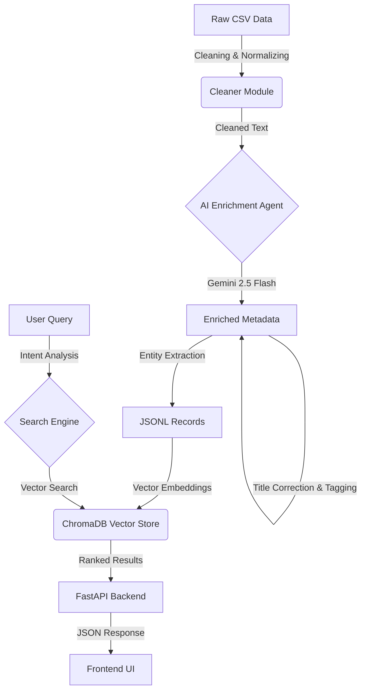

Tender Enrichment & Search Pipeline using Gemini AI & ChromaDB.
# 🛡️ TenderScout AI

A high-precision, AI-powered Tender Search Engine designed to solve the "needle in a haystack" problem. It uses **Multimodal Enrichment (Gemini 2.5)** and **Vector Search (ChromaDB)** to deliver accurate, context-aware results.

---

## 🏗️ System Architecture

The pipeline consists of four main stages: **Cleaning**, **Enrichment**, **Indexing**, and **Search**.



---

## 🚀 Key Features

### 1. **Semantic Search (Beyond Keywords)**
   - Understands intent (e.g., "Hospital Construction" vs. "Medical Supply").
   - Powered by `text-embedding-004` (768 dimensions).
   - "Relatedness Map": Automatically expands queries (e.g., "Road" -> "Highway, Asphalt").

### 2. **Rich Metadata Display**
   - Displays **Authority**, **Location**, **Closing Date**, and **TOT_ID**.
   - **Clickable Titles** linking to original documents.
   - **Match Score**: Visual indicator of relevance based on vector distance.

### 3. **Smart Filters**
   - **Corrigendum Toggle**: Easily include or exclude amendments/updates.
   - **Entity Extraction**: Automatically identifies State, City, and Authority from unstructured text.

### 4. **Resilient Data Pipeline**
   - **Title Auto-Correction**: Fixes typos in source data (e.g., "Constraction" -> "Construction").
   - **Metadata Fallback**: Uses raw CSV data if AI extraction returns "Unknown".

---

### 5. **Interactive Tender Chat** 🆕
   - **Ask Questions**: Chat with any tender to get specific details (e.g., "What is the EMD amount?").
   - **Live Context**: The AI fetches the **live URL content** in real-time to answer questions not present in the summary.
   - **Context-Aware**: Answers are grounded in the specific tender's metadata and documents.

---

## 🎯 Match Score Logic (Calibrated)

We use a **Piecewise Linear Calibration** to map raw vector distances to intuitive "Confidence Scores":

1.  **Excellent Match (> 85%)**: Distance ≤ 0.7 (Strong semantic alignment).
2.  **Strong Match (65-85%)**: Distance 0.7 - 0.9.
3.  **Good Match (45-65%)**: Distance 0.9 - 1.1.
4.  **Potential Lead (< 45%)**: Distance > 1.1.

> **Why?** Raw vector distances in high-dimensional space (768d) are counter-intuitive. A distance of 0.7 is often a "perfect" match in natural language. Our calibration aligns the UI with human expectation.

---

## Tech Stack

- **AI Model**: Google Gemini 2.5 Flash Lite (Enrichment & Intent)
- **Embeddings**: Google `text-embedding-004`
- **Vector DB**: ChromaDB (Local Persistent)
- **Backend**: Python FastAPI (`src/api.py`)
- **Frontend**: Vanilla HTML/JS/CSS (`src/ui/index.html`)
- **Orchestration**: Python Scripts (`src/enrichment/processor.py`)

---

## Getting Started

### Prerequisites
- Python 3.10+
- Google Cloud API Key (Gemini)

### Installation

1.  **Clone the Repo**
    ```bash
    git clone https://github.com/sri1991/tendersontime.git
    cd tendersontime
    ```

2.  **Install Dependencies**
    ```bash
    python3 -m venv venv
    source venv/bin/activate
    pip install -r requirements.txt
    ```

3.  **Configure Environment**
    Create a `.env` file:
    ```bash
    GEMINI_API_KEY="your_api_key_here"
    ```

### Running the App

1.  **Start the Server**
    ```bash
    venv/bin/python -m uvicorn src.api:app --reload --port 8000
    ```
2.  **Open in Browser**
    Go to `http://localhost:8000`

---

## 📦 Data Pipeline Usage

To ingest new data:

1.  **Run Enrichment (Batch Processing)**
    ```bash
    python src/enrichment/processor.py input.csv output.jsonl --limit 1000
    ```

2.  **Index into ChromaDB**
    ```bash
    python src/indexing/chroma_loader.py output.jsonl
    ```

3.  **Full Automation**
    Use `src/ingest_full.py` to process large datasets in chunks.

---

## 🤝 Contributing
1.  Fork the repo.
2.  Create a feature branch (`git checkout -b feature/amazing`).
3.  Commit changes (`git commit -m 'Add amazing feature'`).
4.  Push to branch (`git push origin feature/amazing`).
5.  Open a Pull Request.

---
*Built with ❤️ by TenderScout Team*
